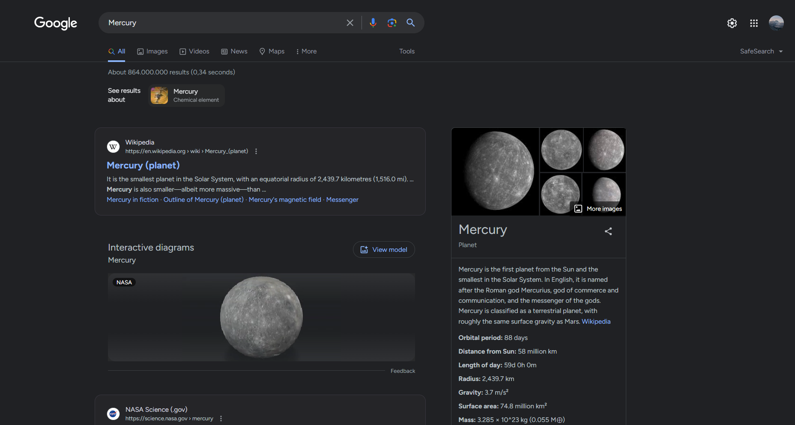

# Google



The following snippet does not use `*` selector for css, due to how many other Google's own pages share the same `www.google.com` address between them.

```css
@import url(https://fonts.googleapis.com/css2?family=Figtree:ital,wght@0,100;0,300;0,400;0,500;0,700;0,900;1,100;1,300;1,400;1,500;1,700;1,900&display=swap);

h3.LC20lb.MBeuO.DKV0Md {
  font-family: Figtree;
  line-height: 150%;
}

div div span {
  font-family: Figtree;
  line-height: 150%;
}

div.ITZIwc {
  font-family: Figtree;
}

div.s75CSd.u60jwe.r2fjmd.AB4Wff {
  font-family: Figtree;
}

div.ZkkK1e.yUTMj.k1U36b {
  font-family: Figtree;
}

textarea.gLFyf {
  font-family: Figtree;
}

div.n0jPhd.ynAwRc.tNxQIb.nDgy9d {
  font-family: Figtree;
}

div.YTDezd {
  margin-top: .5rem;
}

a.ZZ7G7b.A6Smgb {
  display: flex;
  align-items: center;
}

div.zbRPDe.M2qv4b.P4HtKe {
  font-family: Figtree;
}
```
