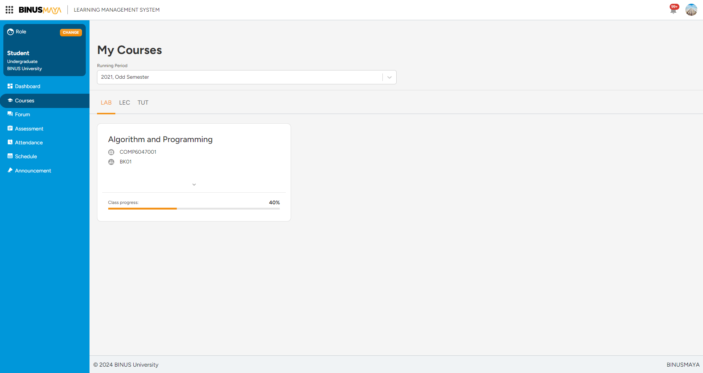
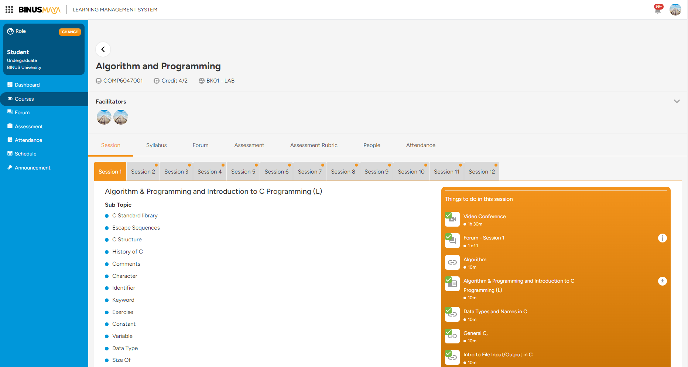

# NewBinusMaya




```css
@import url(https://fonts.googleapis.com/css2?family=Figtree:ital,wght@0,100;0,300;0,400;0,500;0,700;0,900;1,100;1,300;1,400;1,500;1,700;1,900&display=swap);

* {
  font-family: Figtree; 
}

.C--card {
  padding: 1.25rem;
  border-radius: 1rem;
  box-shadow: none;
  border: 1px solid rgba(0, 0, 0, 0.12)
}

div.class-title-wrapper > * {
  font-size: 22px;
  font-weight: 500;
}

div.c-page-header-wrapper {
  padding-top: 6rem;
}

h3.page-title-global {
  font-size: 32px;
  font-weight: 600;
}

div.c-page-region:first-of-type {
  padding-top: 6rem;
}

div div h1 {
  font-size: 26px;
  font-weight: 600;
}

.mc-forum {
  padding: 1rem 2rem;
}

span.title {
  font-size: 20px;
  font-weight: 600;
}

h1.page-name-text {
  font-size: 26px;
  font-weight: 600;
}
```
